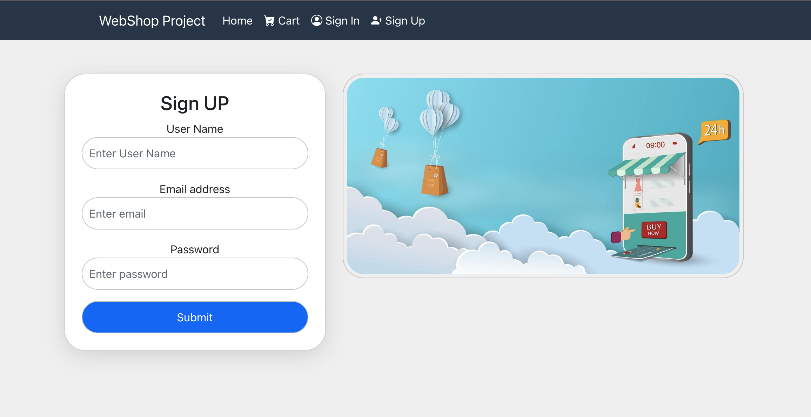

## welcome to the E-commerce Projects

## About the project 

## Features:
* Display products page of the shop
* Ability to filter products by name or certain categories
* Option to register to the site and login
* each user have a personal product cart, where he can add/delete products to it and see the total price
* management page for the admin to add, edit and delete products

### screenshot display from the webapp
* the web shop is current an electronic commerce website that allows customers to directly buy goods  from a seller over the Internet using a web browser.
* But, it is not limited only to the field of electronics, the store owner can put whatever products he wants, depending on what information he entered into the database

### home page:
* the user can view the products and choose item to add the products cart

### filter feature:
*the user can filter the products by category/Brand or by name

### cart page:
*each user that login can add products to cart and can delete the products from cart, the cart is save in the database

### sign up & sign in page:

### management page:
*the admin can add new products, delete products, update products, and view all products

## Client
* React
* React-Router
* React-bootstrap

## Server
* Express.js
* Node.js

## Database
* MongoDB
* Mongoose

