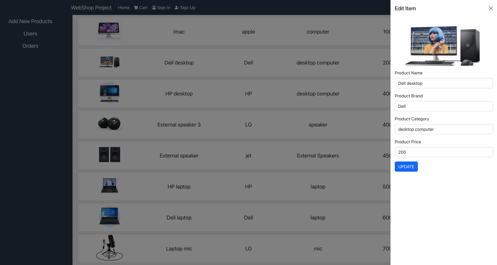

## Welcome to the E-commerce Project

## About the project 

## Client
* React (using HTML & JavaScript & CSS)
* React-Router
* React-bootstrap
## Server
* Express.js
* Node.js
## Database
* MongoDB
* Mongoose

## Features:
* Display products page of the shop
* Ability to filter products by name or certain categories
* Option to register to the site and login
* Each user have a personal product cart, where he can add/delete products to it and see the total price
* Management page for the admin to add, edit and delete products
* Orders Tab in the management page, where the admin can see all the orders of his shop and their details

### Screenshot from the webapp
* The web shop is current an electronic commerce website that allows customers to directly buy goods  from a seller over the Internet using a web browser.
* But, it is not limited only to the field of electronics, the store owner can put whatever products he wants, depending on what information he entered into the database

### Home Page:
* The user can view the products and choose item to add the products cart

### Filter feature:
* The user can filter the products by category/Brand or by name

### Cart Page:
* Each user that login can add products to cart and can delete the products from cart, the cart is save in the database

### Management page:
* The admin can add new products, delete products, update products, and view all products

* Edit product window

* Orders Tab management - the admin can click on the item  in the order and see more information about the order

### Sign up & Sign in page:

